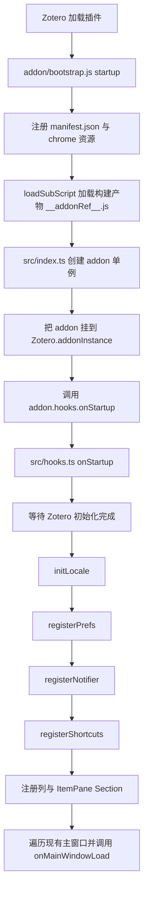
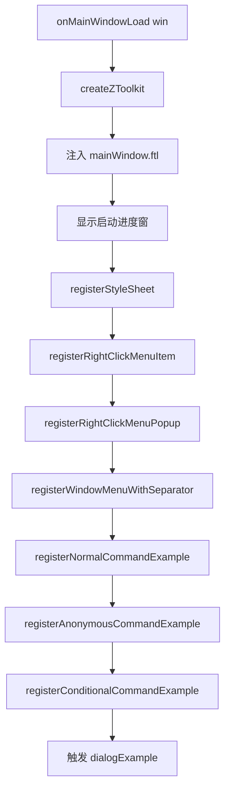
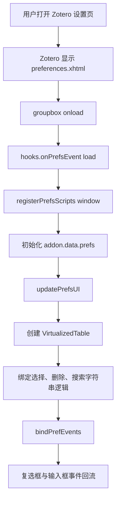
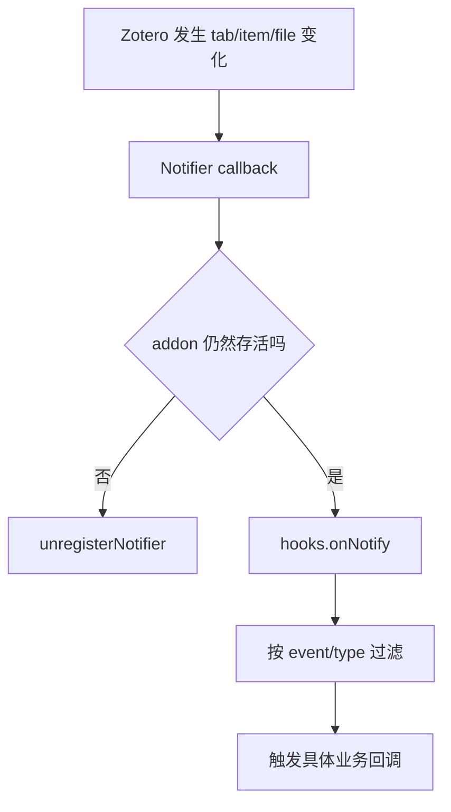
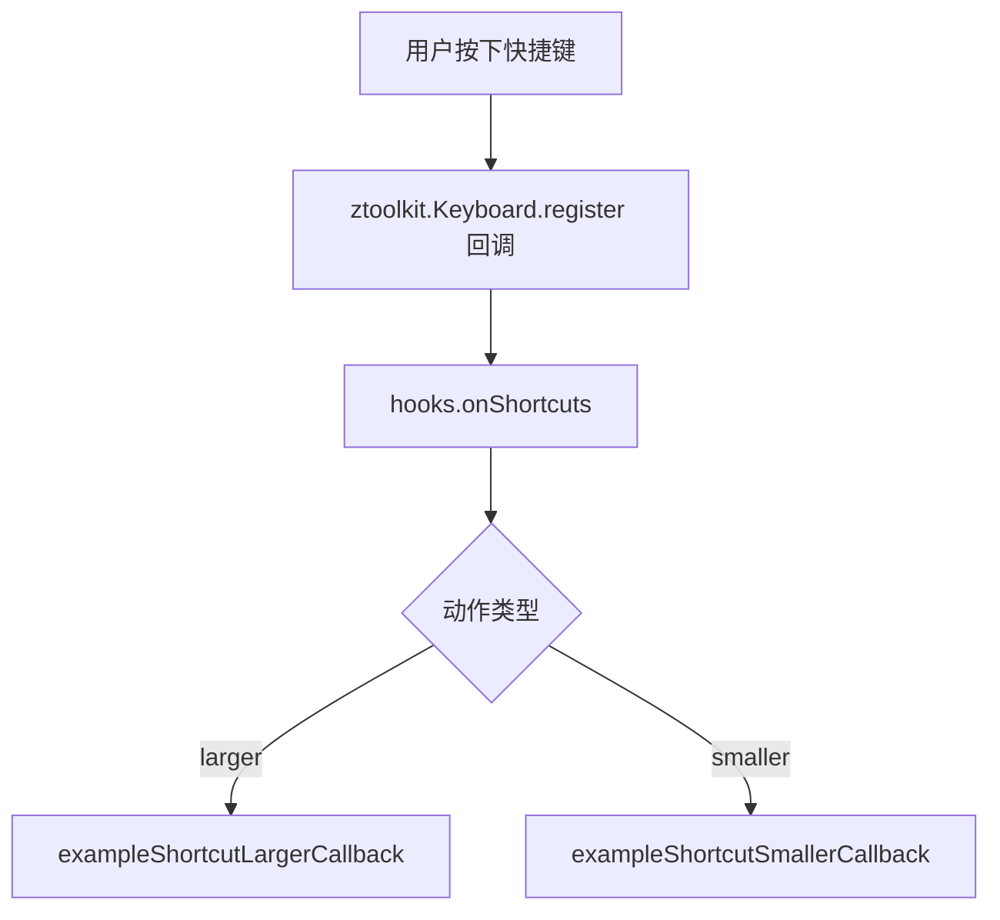
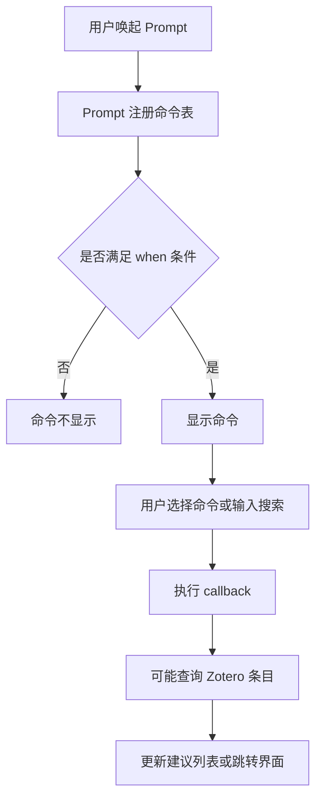
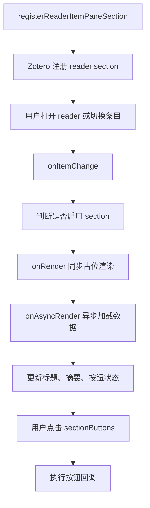
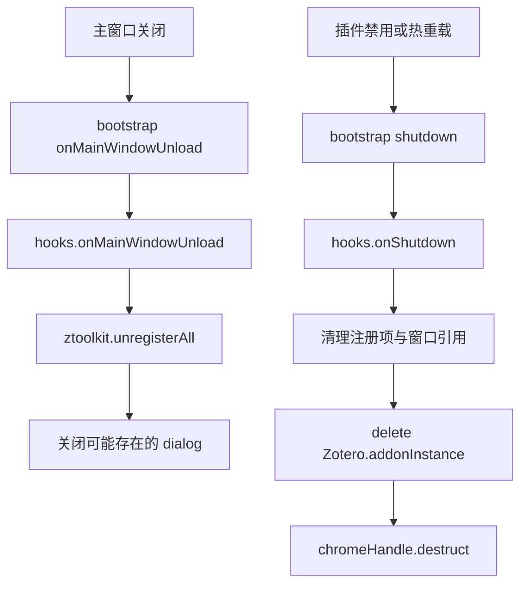

# 插件调用链流程图

这份文档说明这个 Zotero 插件模板从被 Zotero 加载，到把 UI 注入主窗口、偏好页和阅读器面板的大致调用链。

## 总览

模板的调用链可以概括成一句话：

Zotero 调用 bootstrap 生命周期，bootstrap 加载构建后的脚本，脚本创建全局插件单例，再通过 hooks 分发到各类注册函数，最后把菜单、列、面板和偏好页接到 Zotero UI 上。

## 启动主链路

## 窗口 UI 注入链路

## 偏好页链路

## 通知链路

## 快捷键链路

## 命令面板链路

## 阅读器侧边栏链路

## 卸载与清理链路

## 文件与职责对照

核心链路里最关键的文件分别是：

1. [addon/bootstrap.js](addon/bootstrap.js)：Zotero 生命周期入口。
2. [src/index.ts](src/index.ts)：创建全局插件单例与全局变量桥。
3. [src/addon.ts](src/addon.ts)：插件根对象和运行时状态。
4. [src/hooks.ts](src/hooks.ts)：统一初始化和事件分发中心。
5. [src/modules/examples.ts](src/modules/examples.ts)：把各类 Zotero 扩展点注册进 UI。
6. [src/modules/preferenceScript.ts](src/modules/preferenceScript.ts)：偏好页交互逻辑。
7. [addon/content/preferences.xhtml](addon/content/preferences.xhtml)：偏好页结构骨架。

## 真实开发时应如何理解这条链路

如果你后续要把这个模板做成正式插件，最重要的结构原则其实只有一条：

不要把业务逻辑直接塞进 bootstrap 或 hooks，而是把它们当成“接线层”。

更具体地说：

1. bootstrap 只负责把 Zotero 生命周期转发进你的脚本。
2. index 只负责创建全局单例。
3. hooks 只负责注册和路由。
4. 真正的 UI 渲染、数据请求、状态同步，应该拆到独立模块。

这样做的好处是：

1. 插件热重载时更容易定位问题。
2. UI 扩展点变多后不会失控。
3. 后续把模板示例替换成自己的业务模块时，改动范围更清晰。
